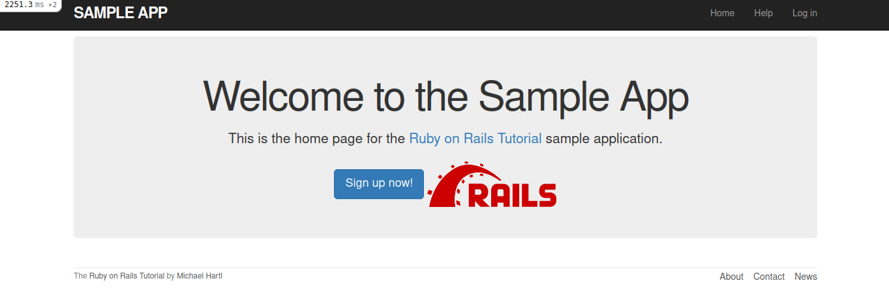
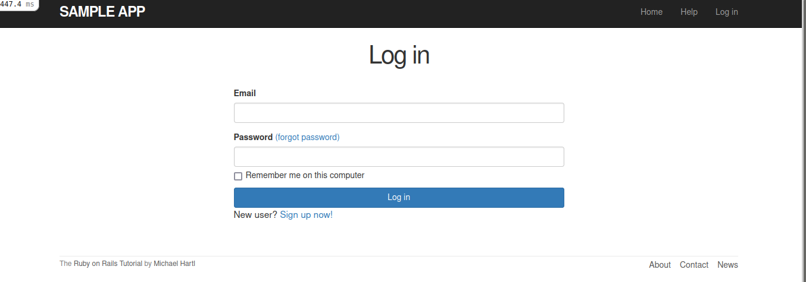
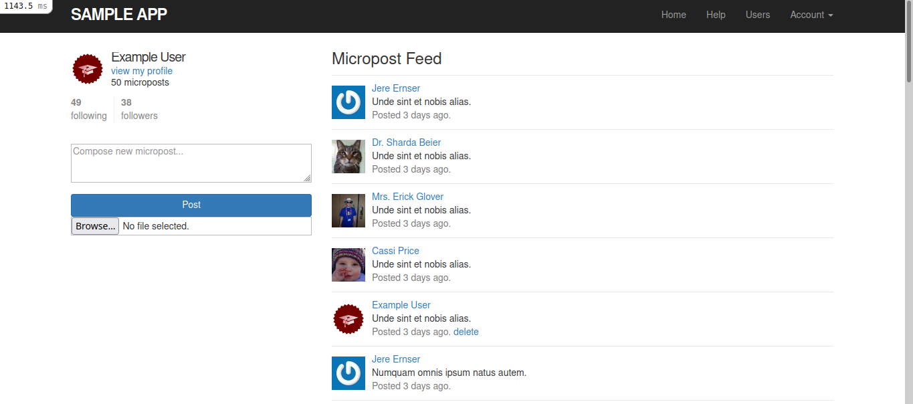

# Sample App

## Description

This is a professional grade app that allows Users to signup and create a post. It also allow users to share messages amongst their followers. A user can follow someone with an interesting message.

## Concepts of Ruby on Rails used

- Models, Views, and Controllers (MVC)
- Data Structures & Relationships
- Routing
- Migrations
- Views with forms, partials, and helpers
- RESTful design
- Adding gems for extra features
- Authentication, sessions and cookies
- Associations

## To install and run

- Clone the project repo from [GitHub](https://github.com/Oxford-G/sample_app.git) using `git clone git@github.com:Oxford-G/sample_app.git`
- Make sure [Ruby-lang](https://www.ruby-lang.org/en/) is installed
- Make sure [Bundler](https://bundler.io/) is installed
- Navigate to the project directory like `cd sample_app`
- Install the required gems. Run `bundle install`
- Install Javascript dependencies. Run `yarn install`
- Install the locale database. Run `rake db:create` `rake db:migrate`
- If you have problems with the gem versions try installing [RVM](https://rvm.io/)
- Launch a Rails Server using `rails server`
- Open your browser and go to `127.0.0.1:3000` or `localhost:3000`

## Screenshot

## Designed With
- Ruby
- Rails
- SCSS
- Git
- Gitflows
- Stylelint
- VS Code

## Contribute to this Project

Contributions, issues, and feature requests are welcome! Start by:

  - Forking the project
  - Cloning the project to your local machine
  - cd into the project directory
  - Run git checkout -b your-branch-name
  - Make your contributions
  - Push your branch up to your forked repository
  - Open a Pull Request with a detailed description of the development branch of the original project for a review

## 😎 Enekwechi Chinonso Gerald

- GitHub: [@Oxford-G](https://github.com/Oxford-G)
- Twitter: [@OXFORD2](https://twitter.com/OXFOXD2)
- Linkedin: [Enekwechi Chinonso G](https://www.linkedin.com/in/chinonso-enekwechi)
## Show your support

Give a ⭐️ if you like this project!
